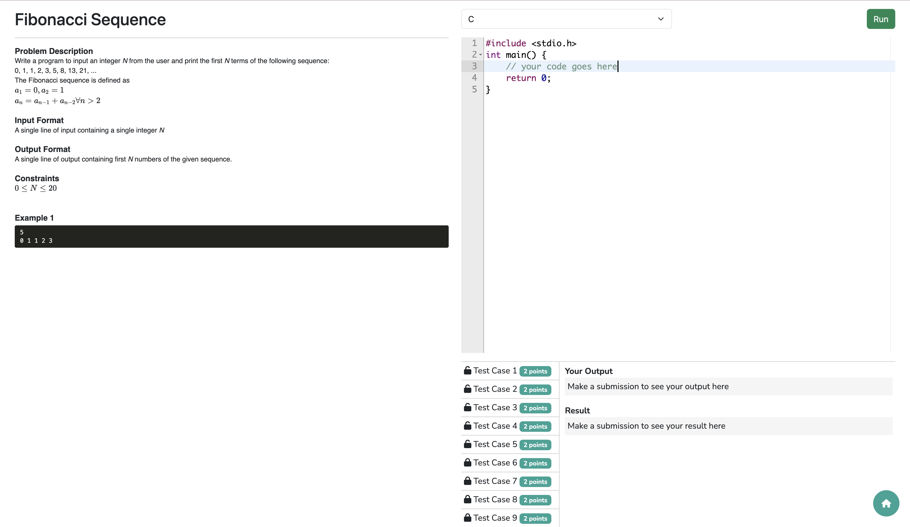

# CodeBook
Boost your coding skills with CodeBook, a platform where you can test your coding skills and understanding by solving problems across various topics starting from scratch to advanced level.  
CodeBook is a containerized Node.js application which can be used to auto-evaluate student's code given a list of test-cases.  


## How to use CodeBook?
The first thing you need to use CodeBook is a problem to solve. You can create a new problem for yourself [here](https://panchalshubham0608.github.io/codebook-problem-generator/) or browse a sample problem from [here](https://github.com/panchalshubham0608/codebook-problem-generator/blob/main/sample_problem.json).  
Now install the CodeBook container with:  
```bash
docker pull ghcr.io/panchalshubham0608/codebook:latest
```
Start the containerized application with:
```bash
docker run -p 8080:8080 -it codebook
```

Browse http://localhost:8080 to get started. You should see the following landing page:


Click on the `Choose a file` button to select the problem (contained in a `*.json` file) to solve (you can find a sample problem [here](https://github.com/panchalshubham0608/codebook-problem-generator/blob/main/sample_problem.json)). The following problem shows an example:  


To terminate the container, press `Ctrl + C`.  
Write your code, play around with test-cases and have fun!  
For any queries or suggestions, please write an email to [shubhampanchal9773@gmail.com](mailto:shubhampanchal9773@gmail.com), I'll be happy to assist you.  
